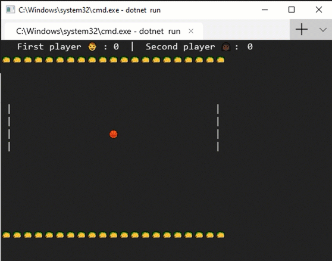

Pong Emoji for Windows Terminal
====================================================

A implementation of Pong using the new Windows Terminal announced at Build 2019

Below is a screenshot of gameplay. 

Instructions:

**Player 1** : Use keys, `WASD` for up, left, down and right.

**Player 2** : Use the `Arrow keys` on the keyboard.

Game goes to 5 points and restarts.

There are bugs. Many bugs. So keep that in mind while using this.
